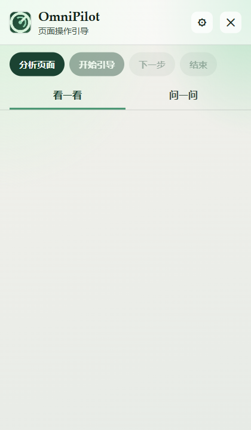
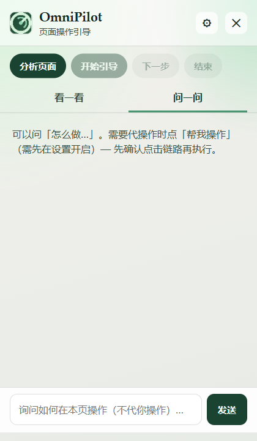
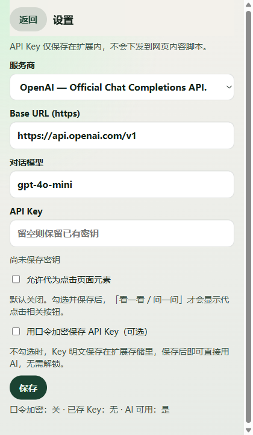
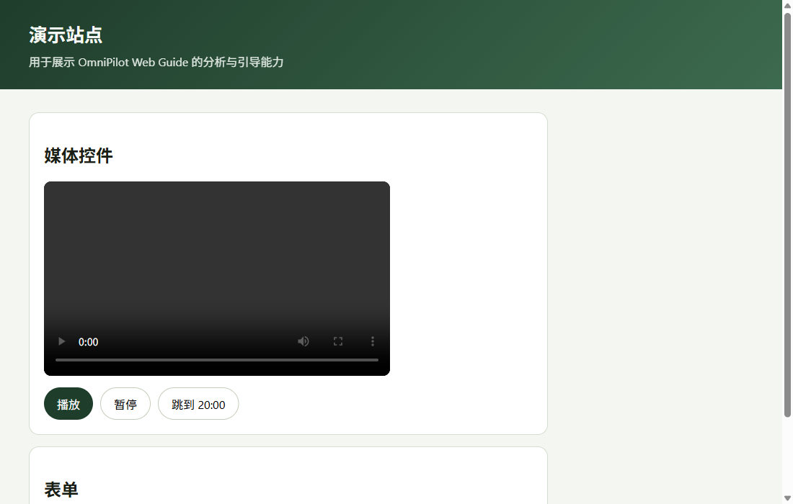

# OmniPilot Web Guide

**English** | [中文](./README.zh-CN.md)

<p align="center">
  
</p>

**OmniPilot Web Guide** is a Chrome / Firefox browser extension that detects what a webpage can do and walks you through it with visual, step-by-step guidance.

| | |
|---|---|
| **Platforms** | Chrome, Edge, Firefox (MV3 / Firefox pack) |
| **Core** | Rule scan · AI interpret · Floating panel · Spotlight tour |
| **Providers** | OpenAI, DeepSeek, Anthropic (via OpenRouter), OpenRouter, Custom |
| **Security** | Optional passphrase vault · SW-only unlock · secrets never in content scripts |
| **Version** | **v0.1.24** |

---

## Screenshots

<p align="center">
  
  &nbsp;
  
</p>

<p align="center">
  <em>Floating panel · Look (analyze / tour) · Ask (chat guidance)</em>
</p>

<p align="center">
  
  &nbsp;
  
</p>

<p align="center">
  <em>Settings (provider / API key / assisted click / vault) · Demo page for analysis</em>
</p>

---

## What it does

1. **Analyze page** — heuristic scan of interactive controls on any normal webpage  
2. **AI guidance** — optional multi-provider Chat Completions names features and writes how-to steps  
3. **Rules fallback** — works without a key (or when the vault is locked) using scan labels  
4. **Spotlight tour** — Shadow DOM highlight + step cards from the floating panel  
5. **Assisted click (opt-in)** — off by default; after enable + confirm, run a 1…N click/seek chain  

---

## Install (development)

```bash
npm install
npm run dev          # Chrome
npm run dev:firefox  # Firefox
```

Load the unpacked extension from `.output/chrome-mv3` (or Firefox output) in the browser.

Click the toolbar icon to open a **floating, draggable** guide panel on the page (Analyze + Ask chat). UI chrome and AI answers follow the browser/system language (zh / en).

**Settings**: gear icon in the panel (or extension options) → provider → API key → optional passphrase encryption → optional assisted click.

Regenerate README screenshots (optional):

```bash
npm run build
node scripts/capture-readme-shots.mjs
```

---

## Scripts

| Command | Description |
|---------|-------------|
| `npm run dev` | WXT dev (Chrome) |
| `npm run build` | Production Chrome build |
| `npm run build:firefox` | Firefox build |
| `npm test` | Vitest unit/integration |
| `npm run test:e2e` | Playwright smoke |
| `npm run assert:content` | Fail if content bundle looks like it embeds secrets |
| `npm run ci` | test + build + assert + firefox build |
| `npm run deploy` | CI + pack Chrome/Firefox zips (see `deploy/README.md`) |
| `npm run deploy:dry-run` | Print pack steps only |

---

## Security notes

- API keys live in `chrome.storage.local` (plaintext) or an AES-GCM vault (hardened)  
- Unlock session is **service-worker memory only**; passphrase is never persisted for auto-unlock  
- Privileged page ops require extension-page sender + background relay + one-time plan token  
- Assisted click is **off by default** and needs an explicit risk acknowledgment on enable  
- Content scripts never receive API keys  
- Base URL must be `https://`  

Series sibling: [omnipilot-lingua-bridge](https://github.com/zayeagle/omnipilot-lingua-bridge)

---

## License

See [LICENSE](./LICENSE).
